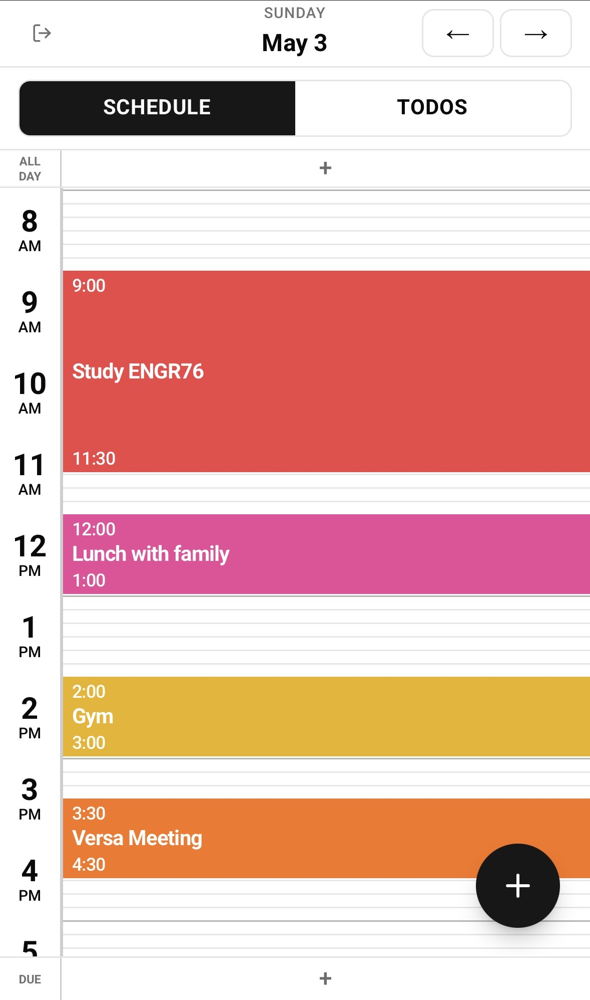
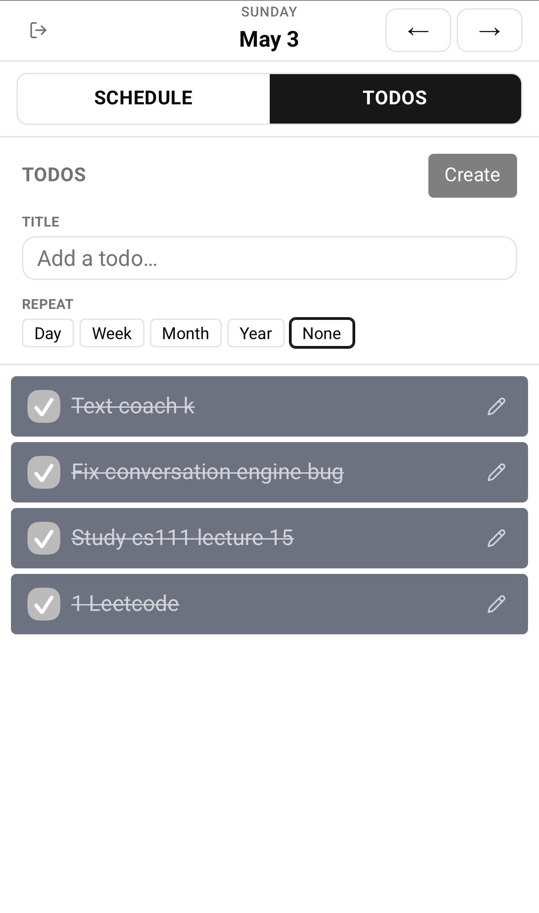

# Personal Calendar

A calendar web app I built as a faster, more customizable alternative to Google Calendar, with the features I wanted — starting with built-in to-do lists. The same calendar is available as a web app, a mobile site, a terminal CLI, and a Claude Code (MCP) integration, all backed by the same data.

The app is live at [personal-calendar-ur0a.onrender.com](https://personal-calendar-ur0a.onrender.com). Sign in with Google to get your own private calendar.

## Desktop

**Day view**


**Week view**


**Month view**


## Mobile

Day view and to-do view:

 

## Why I built it

I used Google Calendar for a while, but a few things didn't work well for me:

- **No to-do lists.** I wanted daily todos next to my events, with unfinished ones rolling over to the next day automatically.
- **Creating and editing events was slow.** It took too many clicks for something I do often.
- **Few keyboard shortcuts I would use.** I wanted to navigate and edit without using the mouse.
- **Limited customization.** I wanted my own categories, colors, and behavior.

So I built my own version. I later added a mobile version so I can use it on my phone, a CLI so Claude Code can quickly read and change events for me, and email reminders.

## Features

Standard calendar features:

- **Day, week, and month views.**
- **Timed events** — click an empty slot to create, drag to move, edit, and delete.
- **All-day events** ("big events") such as birthdays, holidays, and exams.
- **Recurring items** with per-occurrence edits — change just one occurrence, this and everything after, or the whole series.
- **Email reminders** on events, big events, and due dates.
- **Categories with custom colors** for organizing and color-coding items.
- **Google sign-in**, multi-user — every account gets its own private calendar.

Features I added on top:

- **Daily to-do lists with automatic rollover** — unfinished todos carry over to the next day.
- **Due dates** — timed deadlines tracked alongside the schedule.
- **Keyboard navigation and editing** — `←`/`→` to move, `T` for today, `D`/`W`/`M` to switch views, `Enter` to save, `Esc` to close, `Shift+Enter` to delete.
- **A daily to-do digest** emailed at noon, including anything that rolled over.
- **A terminal CLI** for reading and editing the calendar from the command line.
- **A Claude Code (MCP) integration** that exposes the calendar as tools for managing it in natural language.
- **A mobile web version** — a touch-friendly layout with a tabbed schedule/todos view and a quick-add button.

## Tech stack

**Frontend** — Next.js 16 (App Router), React 19, TypeScript, Tailwind CSS, shadcn/ui, TanStack Query, React Hook Form + Zod.

**Dates & recurrence** — Luxon (times stored as UTC, displayed in `America/Los_Angeles`) and `rrule` for RFC-5545 recurrence.

**Backend & data** — Next.js API routes, PostgreSQL with Prisma, and NextAuth v5 for Google OAuth.

**Email** — Resend sends the reminder and digest emails.

## Hosting

- **Web app and reminders run on Render** — a web service for the app, plus a cron job that runs once a minute to send any due reminders and the noon to-do digest.
- **Postgres is hosted on Neon** (managed) in production, and runs in Docker for local development.
- **Sign-in** uses Google OAuth; **email** is sent through Resend.

## Running locally

```bash
docker-compose up -d      # start Postgres
npx prisma migrate dev    # apply the schema
npm run dev               # http://localhost:3000
```

Copy `.env.example` to `.env` and fill in `AUTH_SECRET`, `AUTH_GOOGLE_ID`, and `AUTH_GOOGLE_SECRET` (plus `RESEND_API_KEY` / `EMAIL_FROM` if you want reminder emails).
