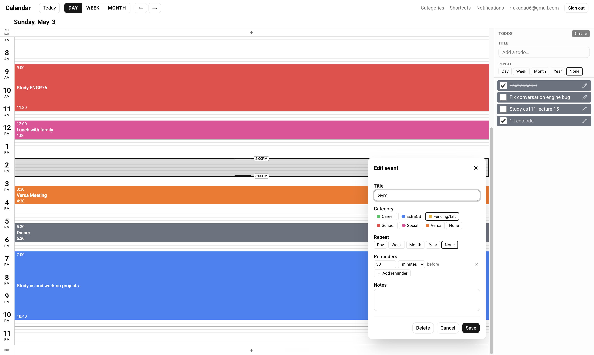
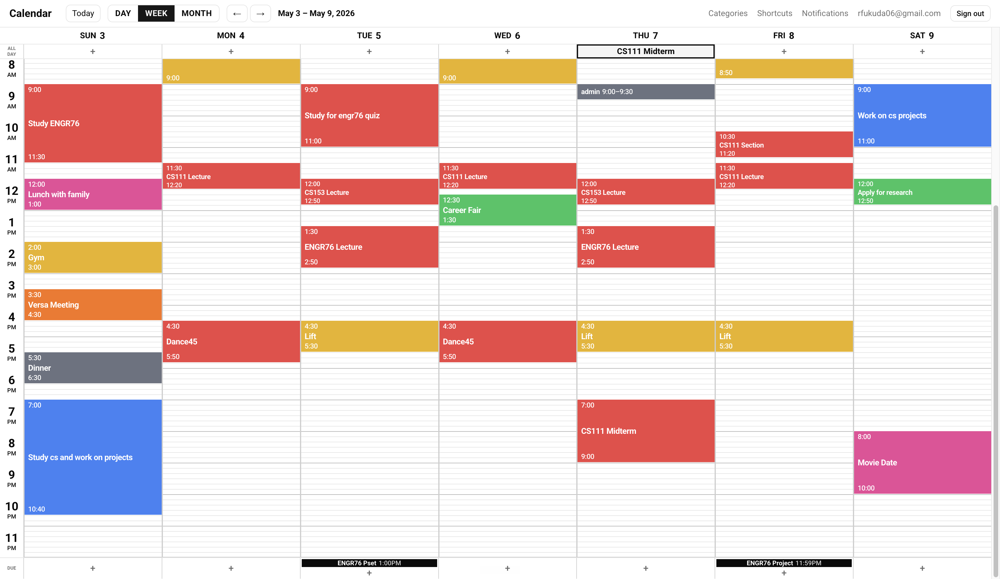
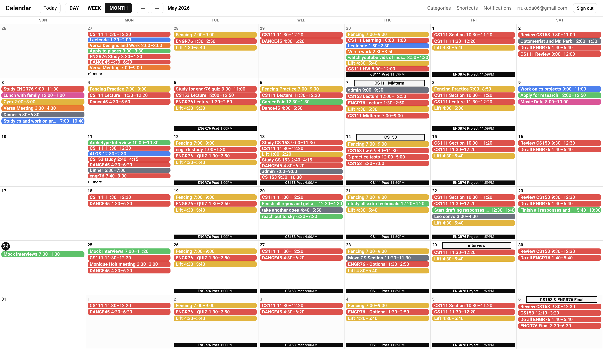
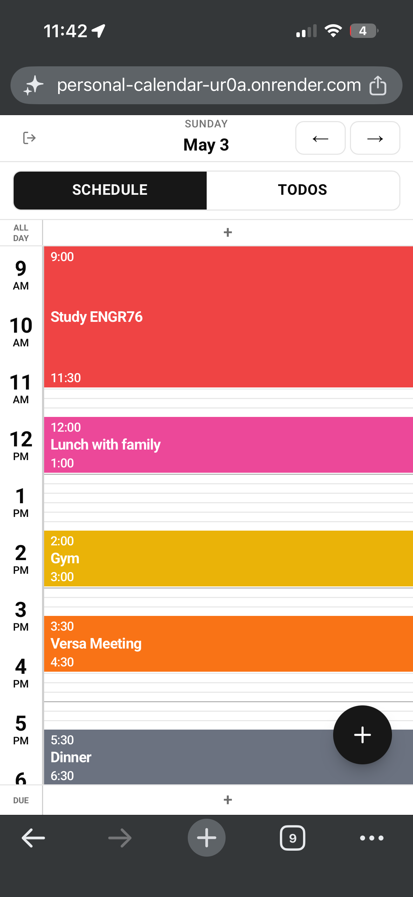
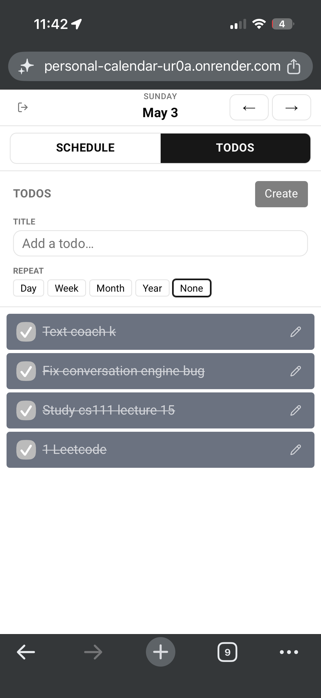

# Personal Calendar

A faster, more customizable alternative to Google Calendar. Available as a web app, mobile site, terminal CLI, and Claude Code (MCP) integration.

[personal-calendar-ur0a.onrender.com](https://personal-calendar-ur0a.onrender.com). Sign in with Google to get your own private calendar.



## Why I built it

I used Google Calendar for years, but a few things didn't work well for me:

- **No to-do lists.**
- **Very slow creating and editing events.**
- **Few keyboard shortcuts I would use.**
- **Limited customization.**

So I built my own version. Plus mobile, a Claude Code CLI, and email reminders.

## Features

| Standard features             | Features I added on top                        |
| ----------------------------- | ---------------------------------------------- |
| Day, week, and month views    | Daily to-do lists with automatic rollover      |
| Timed events                  | Keyboard shortcuts for navigation and editing  |
| All-day events                | Snap-to-cursor event creation                  |
| Recurring items               | Terminal CLI and Claude Code (MCP) integration |
| Email reminders               | Daily to-do digest notification                |
| Categories with custom colors | Due dates                                      |
| Google sign-in (multi-user)   | Mobile web version                             |

## Desktop

_Day view was shown previously._

**Week view**



**Month view**



## Mobile

Day view and to-do view:

 

## Tech stack

**Frontend** — Next.js 16 (App Router), React 19, TypeScript, Tailwind CSS, shadcn/ui, TanStack Query, React Hook Form + Zod.

**Backend & data** — Next.js API routes, PostgreSQL with Prisma, and NextAuth v5 for Google OAuth.

**Dates & recurrence** — Luxon (times stored as UTC, displayed in `America/Los_Angeles`) and `rrule` for RFC-5545 recurrence.

**Email** — Resend sends the reminder and digest emails.

## Hosting

- **Web app and reminders run on Render** — a web service for the app, plus a cron job that runs once a minute to send any due reminders and the noon to-do digest.
- **Postgres is hosted on Neon** (managed) in production, and runs in Docker for local development.
- **Sign-in** uses Google OAuth; **email** is sent through Resend.

## Running locally

```bash
docker-compose up -d      # start Postgres
npx prisma migrate dev    # apply the schema
npm run dev               # http://localhost:3000
```

Copy `.env.example` to `.env` and fill in `AUTH_SECRET`, `AUTH_GOOGLE_ID`, and `AUTH_GOOGLE_SECRET` (plus `RESEND_API_KEY` / `EMAIL_FROM` if you want reminder emails).
